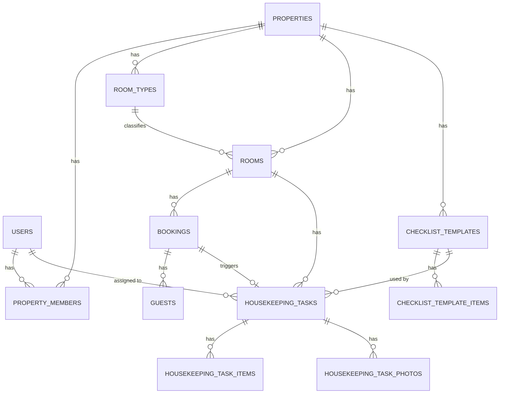
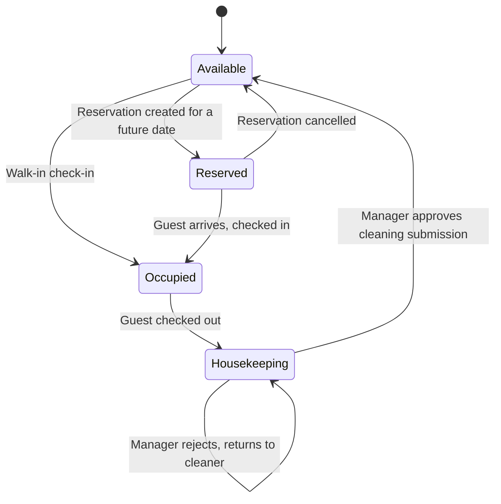

# Hotel Management System — Technical Specification

## 1. Overview

A multi-property hotel management system with role-based access across four tiers — Property Owner, Manager, Receptionist, Cleaner. Covers property and room setup, reservations and walk-in check-in/check-out, and a manager-assigned, photo-verified housekeeping workflow.

## 2. Goals & Non-Goals

**In scope (v1)**
- Multi-property support — one Owner, many Properties
- Role-based access: Owner, Manager, Receptionist, Cleaner
- Room type & room inventory management
- Reservations (advance booking) and walk-in check-in
- Guest capture with government ID photo upload
- Checkout → Housekeeping → Manager review → Available workflow
- Manager-assigned, template-driven cleaning checklists with photo proof

**Explicitly out of scope (v1)**
- Payments / billing / invoicing
- No-show and late-cancellation automation
- Damage / incident tracking
- In-app notifications (email/SMS/push)
- Multi-language support
- Rate/pricing engine — room type may carry a display price only

## 3. Roles & Permissions

| Action | Owner | Manager | Receptionist | Cleaner |
|---|:---:|:---:|:---:|:---:|
| Create/edit property (name, address, photos, total rooms) | ✅ | ❌ | ❌ | ❌ |
| Delete property | ✅ | ❌ | ❌ | ❌ |
| Invite/remove staff | ✅ | ✅ own property | ❌ | ❌ |
| Define room types | ✅ | ✅ | ❌ | ❌ |
| Create/edit/delete rooms, override room status | ✅ | ✅ | ❌ | ❌ |
| Update property photos | ✅ | ✅ | ❌ | ❌ |
| Create/edit checklist templates | ✅ | ✅ | ❌ | ❌ |
| View room inventory | ✅ | ✅ | ✅ own property | ❌ |
| Create reservation / walk-in check-in | ✅ | ✅ | ✅ | ❌ |
| Check out a guest | ✅ | ✅ | ✅ | ❌ |
| Assign housekeeping task to a cleaner | ✅ | ✅ | ❌ | ❌ |
| View housekeeping tasks | ✅ | ✅ all | ❌ | ✅ own tasks only |
| Complete checklist + upload photos | ❌ | ❌ | ❌ | ✅ own tasks only |
| Approve/reject housekeeping submission | ✅ | ✅ | ❌ | ❌ |

Every query is scoped to the properties a user belongs to. An Owner sees only their own properties; Managers, Receptionists, and Cleaners see only the property they were invited to.

## 4. Architecture

- **Frontend + backend:** Next.js (App Router), one codebase — Route Handlers for the API surface, Server Actions for mutations where convenient.
- **Auth & multi-tenancy:** Clerk, with **one Clerk Organization per Property**. This gets you invitations, membership management, and a pre-built org switcher for Owners with multiple properties for free. Coarse membership lives in Clerk; the fine-grained app role (owner/manager/receptionist/cleaner) is mirrored into your own `property_members` table so authorization checks are a local SQL join, not a Clerk API round-trip, on every request.
- **Database:** Neon Postgres + Drizzle ORM — typed, migration-friendly, pairs naturally with Next.js route handlers.
- **File storage:** Firebase Storage for property photos, guest ID photos, and housekeeping proof photos, under a `properties/{propertyId}/...` path convention. Serve everything via short-lived signed URLs — never a public bucket, given the ID photos.
- **Validation:** Zod schemas shared between client forms and server handlers.

## 5. Data Model

**users** — local mirror of Clerk users, synced via webhook, keyed by `clerk_user_id`.

**properties** — id, `clerk_org_id`, `owner_user_id`, name, address, `photo_urls[]`, `total_rooms` (planning figure set at creation), timestamps.

**property_members** — id, `property_id`, `user_id`, `role` (owner / manager / receptionist / cleaner), `invited_by`, timestamps. The Owner also gets a row here with `role = 'owner'` so permission checks are uniform across roles.

**room_types** — id, `property_id`, name, description, `display_price`, `max_occupancy`.

**rooms** — id, `property_id`, `room_type_id`, `room_number`, `floor`, `status` (available / reserved / occupied / housekeeping).

**checklist_templates** — id, `property_id`, name, `default_for_room_type_id` (nullable), `created_by`.

**checklist_template_items** — id, `template_id`, label, `sort_order`.

**bookings** — id, `property_id`, `room_id`, `status` (reserved / checked_in / checked_out / cancelled), `scheduled_check_in_at`, `scheduled_check_out_at`, `actual_check_in_at`, `actual_check_out_at`, `adult_count`, `child_count`, `created_by`, timestamps.

**guests** — id, `booking_id`, `guest_type` (adult / child), name, address (nullable for child), gender, age, contact (nullable for child), `id_photo_front_url` (nullable for child), `id_photo_back_url` (nullable for child), `is_primary`.

**housekeeping_tasks** — id, `room_id`, `booking_id` (nullable), `checklist_template_id`, `assigned_cleaner_id`, `assigned_by`, `status` (assigned / in_progress / submitted / approved / rejected), `submitted_at`, `reviewed_at`, `reviewed_by`, `review_notes`.

**housekeeping_task_items** — id, `task_id`, `template_item_id`, `is_completed`, `completed_at`.

**housekeeping_task_photos** — id, `task_id`, `photo_url`, `uploaded_at`.



## 6. Room Lifecycle



| Transition | Trigger | Actor |
|---|---|---|
| Available → Reserved | Reservation created for a future date | Receptionist / Manager |
| Available → Occupied | Walk-in check-in, immediate | Receptionist / Manager |
| Reserved → Occupied | Guest arrives, checked in | Receptionist / Manager |
| Reserved → Available | Reservation cancelled | Receptionist / Manager |
| Occupied → Housekeeping | Guest checked out | Receptionist / Manager |
| Housekeeping → Available | Manager approves the cleaner's submission | Manager |

`Housekeeping` is a single room status; the underlying `housekeeping_tasks.status` tracks `assigned → in_progress → submitted → approved/rejected`, so the manager's review queue is a query against tasks, not a separate room state. Manager can also write `rooms.status` directly (e.g. pulling a room out of service) outside this guest-driven flow.

## 7. Core User Flows

1. **Owner onboards a property** — creates property (name, address, photos, total rooms) → Clerk Org created → invites a Manager.
2. **Manager sets up inventory** — defines room types → creates individual rooms (number, floor, type) → builds checklist templates → optionally sets a default template per room type → invites Receptionists and Cleaners.
3. **Receptionist creates a reservation** — picks an available room, sets a future check-in date and duration → room moves to `Reserved`.
4. **Receptionist checks a guest in** (walk-in, or an arriving reservation) — check-in form (§8) → room moves to `Occupied`.
5. **Receptionist checks a guest out** — single action, optional note → room moves to `Housekeeping`; a `housekeeping_task` is created against the room type's default checklist template.
6. **Manager assigns the task** — picks a cleaner, can swap the template if needed.
7. **Cleaner completes the task** — sees only tasks assigned to them → works through the checklist → uploads photos → submits.
8. **Manager reviews** — approves (room → `Available`) or rejects with notes (task returns to the cleaner).

## 8. Check-In Form Spec

**Section 1 — Stay details:** room (available rooms only), check-in date/time, duration in nights, adult count, child count.

**Section 2 — Guests, dynamic, repeats per count:**
- Adult: name, address, gender, age, contact, ID front photo, ID back photo, primary-guest flag — exactly one adult must be primary.
- Child: name, gender, age.

### Validation (Zod, representative)

```ts
const isValidIdImage = (f: File) =>
  f.size <= 5 * 1024 * 1024 &&
  ["image/jpeg", "image/png", "image/webp"].includes(f.type);

const adultGuestSchema = z.object({
  name: z.string().min(2).max(100),
  address: z.string().min(5).max(300),
  gender: z.enum(["male", "female", "other"]),
  age: z.number().int().min(18).max(120),
  contact: z.string().regex(/^\+?[0-9]{7,15}$/),
  idPhotoFront: z.instanceof(File).refine(isValidIdImage),
  idPhotoBack: z.instanceof(File).refine(isValidIdImage),
  isPrimary: z.boolean().default(false),
});

const childGuestSchema = z.object({
  name: z.string().min(2).max(100),
  gender: z.enum(["male", "female", "other"]),
  age: z.number().int().min(0).max(17),
});

const checkInSchema = z
  .object({
    roomId: z.string().uuid(),
    checkInAt: z.coerce.date(),
    durationNights: z.number().int().min(1).max(60),
    adultCount: z.number().int().min(1).max(10),
    childCount: z.number().int().min(0).max(10),
    adults: z.array(adultGuestSchema).min(1),
    children: z.array(childGuestSchema),
  })
  .refine((d) => d.adults.length === d.adultCount, {
    message: "Adult forms must match adult count",
  })
  .refine((d) => d.children.length === d.childCount, {
    message: "Child forms must match child count",
  })
  .refine((d) => d.adults.filter((a) => a.isPrimary).length === 1, {
    message: "Exactly one adult must be marked primary",
  });
```

## 9. API Surface (representative)

**Properties**
- `POST /api/properties` — Owner creates a property
- `GET /api/properties` — Owner lists their properties
- `PATCH /api/properties/:id` — Owner updates name/address/photos/total rooms
- `DELETE /api/properties/:id` — Owner only

**Staff**
- `POST /api/properties/:id/invitations` — Owner/Manager invites a user with a role
- `GET /api/properties/:id/members` — Owner/Manager lists staff

**Room types & rooms**
- `POST /api/properties/:id/room-types` — Owner/Manager
- `POST /api/properties/:id/rooms` — Owner/Manager
- `PATCH /api/rooms/:id` — Owner/Manager, status/type/floor
- `GET /api/properties/:id/rooms` — Owner/Manager/Receptionist

**Checklist templates**
- `POST /api/properties/:id/checklist-templates` — Owner/Manager
- `PATCH /api/checklist-templates/:id` — Owner/Manager

**Bookings**
- `POST /api/bookings` — create reservation or walk-in — Receptionist/Manager
- `POST /api/bookings/:id/check-in` — mark a reserved booking's guest as arrived
- `POST /api/bookings/:id/check-out` — Receptionist/Manager, triggers housekeeping task creation
- `POST /api/bookings/:id/cancel` — Receptionist/Manager

**Housekeeping**
- `POST /api/housekeeping-tasks` — Manager assigns a room to a cleaner
- `GET /api/housekeeping-tasks?assignedTo=me` — Cleaner's own queue
- `PATCH /api/housekeeping-tasks/:id/items/:itemId` — Cleaner toggles a checklist item
- `POST /api/housekeeping-tasks/:id/photos` — Cleaner uploads a photo
- `POST /api/housekeeping-tasks/:id/submit` — Cleaner submits for review
- `POST /api/housekeeping-tasks/:id/review` — Manager approves/rejects

## 10. Non-Functional Requirements

- **Authorization:** every mutation re-checks role and property membership server-side — client-side role gating is UX only, never the actual guard.
- **Tenant isolation:** every query filtered by `property_id`; a Manager on Property A must never be able to read or write Property B's data.
- **PII handling:** ID photos and guest contact details are sensitive. Firebase Storage rules should deny public read and serve via short-lived signed URLs, restricted to Owner/Manager/Receptionist — Cleaner never gets guest data. **Open decision:** retention window for ID photos (e.g. auto-purge N days after checkout) — not decided yet, needs a call before production.
- **Idempotency:** check-in/checkout/submit actions should be safe against double-submission — disable-on-click plus a server-side status check.

## 11. Phased Build Plan

1. **Foundation** — Next.js scaffold, Clerk + Neon + Drizzle wiring, base schema migration, deploy pipeline.
2. **Multi-tenancy & roles** — property CRUD, Clerk Org-per-property, `property_members`, RBAC middleware, staff invitations.
3. **Inventory** — room types, rooms, property photo management.
4. **Reservations & stays** — reservation creation, walk-in check-in, check-in form + validation, checkout action, room state transitions.
5. **Housekeeping** — checklist templates, task assignment, cleaner checklist UI + photo upload, manager review queue.
6. **Hardening** — signed-URL access control, PII retention job, empty/error states, production deploy.

## 12. Deferred / Future Considerations

No-show handling, payments/invoicing, damage/incident tracking, notifications, multi-language support, rate/pricing engine.
